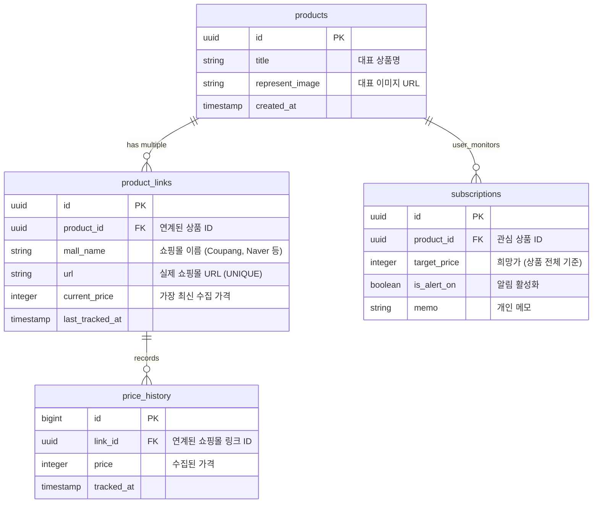

# Supabase Database Schema Design (Revised for Multi-Mall Support)

이 문서는 한 상품에 대해 여러 쇼핑몰 URL(최대 5개 등)을 등록하여 가격을 비교하고 추적할 수 있도록 개선된 스키마입니다.

## 1. 테이블 구조 (Mermaid)



## 2. SQL DDL (Revised)

```sql
-- 1. Products Table (대표 상품 정보)
CREATE TABLE products (
    id UUID PRIMARY KEY DEFAULT gen_random_uuid(),
    title TEXT NOT NULL,
    represent_image TEXT,
    created_at TIMESTAMP WITH TIME ZONE DEFAULT NOW()
);

-- 2. Product Links Table (각 쇼핑몰별 링크)
CREATE TABLE product_links (
    id UUID PRIMARY KEY DEFAULT gen_random_uuid(),
    product_id UUID REFERENCES products(id) ON DELETE CASCADE,
    mall_name TEXT NOT NULL,
    url TEXT UNIQUE NOT NULL,
    current_price INTEGER,
    last_tracked_at TIMESTAMP WITH TIME ZONE DEFAULT NOW(),
    created_at TIMESTAMP WITH TIME ZONE DEFAULT NOW()
);

-- 3. Price History Table (링크별 가격 이력)
CREATE TABLE price_history (
    id BIGINT GENERATED BY DEFAULT AS IDENTITY PRIMARY KEY,
    link_id UUID REFERENCES product_links(id) ON DELETE CASCADE,
    price INTEGER NOT NULL,
    tracked_at TIMESTAMP WITH TIME ZONE DEFAULT NOW()
);

-- 4. Subscriptions (사용자 관심 설정)
CREATE TABLE subscriptions (
    id UUID PRIMARY KEY DEFAULT gen_random_uuid(),
    product_id UUID REFERENCES products(id) ON DELETE CASCADE,
    target_price INTEGER,
    is_alert_on BOOLEAN DEFAULT TRUE,
    memo TEXT,
    created_at TIMESTAMP WITH TIME ZONE DEFAULT NOW()
);

-- Enable RLS
ALTER TABLE products ENABLE ROW LEVEL SECURITY;
ALTER TABLE product_links ENABLE ROW LEVEL SECURITY;
ALTER TABLE price_history ENABLE ROW LEVEL SECURITY;
ALTER TABLE subscriptions ENABLE ROW LEVEL SECURITY;

-- Policies (Development: Allow All)
CREATE POLICY "Allow All Access" ON products FOR ALL USING (true);
CREATE POLICY "Allow All Access" ON product_links FOR ALL USING (true);
CREATE POLICY "Allow All Access" ON price_history FOR ALL USING (true);
CREATE POLICY "Allow All Access" ON subscriptions FOR ALL USING (true);
```

---
**변경 사항 및 장점**:
- **1:N 구조**: `products` 테이블은 하나지만, 여기에 연결된 `product_links`를 최대 5개까지 가질 수 있습니다.
- **유연성**: 특정 쇼핑몰 URL만 삭제하거나 새로 추가하기 쉽습니다.
- **가격 비교**: 한 상품(product_id)에 연결된 여러 링크의 `current_price`를 비교하여 최저가를 쉽게 찾을 수 있습니다.
- **이력 분리**: 쇼핑몰별로 가격 변동 그래프를 각각 그리거나 합쳐서 그릴 수 있도록 `price_history`를 `link_id`에 연결했습니다.
