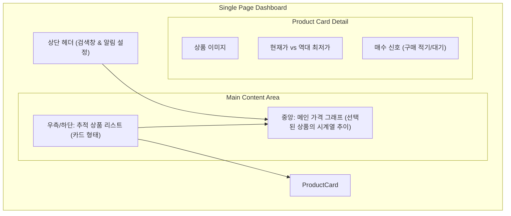

# 화면 구조 (UI Structure)

싱글 페이지(SPA)로 구현될 화면의 구성도입니다.

### 주요 구성 요소 설명
1. **상단 검색바**: 상품명이나 코드를 입력하면 즉시 검색 결과 모달이 뜨고, 상품을 선택하면 추적 리스트에 추가됩니다.
2. **인터랙틱 차트**: 마우스를 올리면 날짜별 상세 가격을 확인할 수 있으며, 주/월/분기별로 기간을 조정할 수 있습니다.
3. **매수 타점 알림**: 사용자가 설정한 목표가보다 낮아지면 강조 표시(Highlight)를 통해 즉시 알려줍니다.
4. **화이트 미니멀 디자인**: 흰색 배경을 기본으로 하여 상품 이미지의 본연의 색감이 가장 잘 드러나게 설계합니다. 카드에는 얕은 그림자를 주어 깔끔하고 프리미엄한 느낌을 강조합니다.
